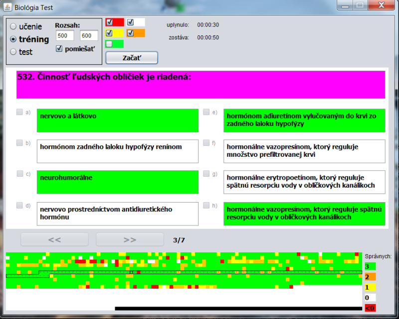

# PrijimackyTester
*java desktop app for preparing High school students for admission exams for Medicine study, biology test*

Aplikacia obsahuje 1500 otazok z biologie po 8 odpovedi. Kazda otazka ma svoje skore z intervalu <-1,3> podla toho kolkokrat bola otazka spravne zodpovedana a podla toho zobrazenie na obrazku.

